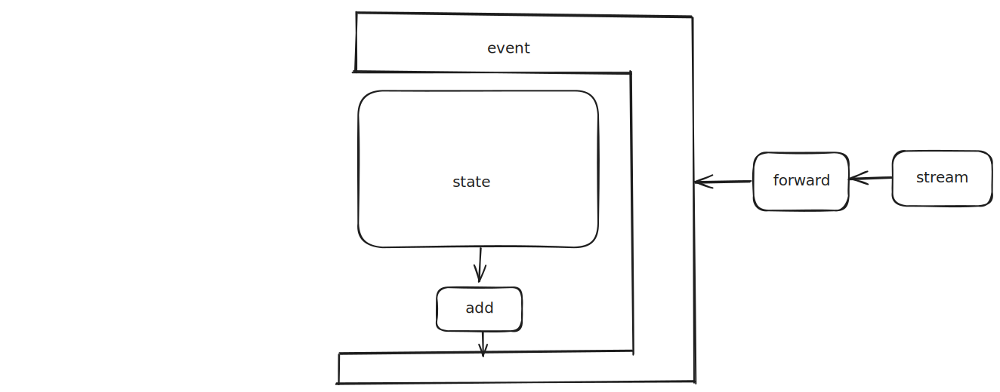

# cms — Controlled Markov Stream

A tiny layer on top of `bloc` that models your app as **States** `S`, **Actions** `A`, and a **deterministic Markov kernel**. It gives you a single place to decide `S × A → Δ S`, while still letting you (1) dispatch follow-up actions and (2) relay external streams into actions. (Ui: y = C s + D a)



## Math (deterministic kernel)

* Kernel: $`k: S \times A \to \Delta S`$
* Update: $`S_{t+1} = k(S_t, A_t)`$

In code, you implement:

```dart
FutureOr<S?> kernel(S state, A action);
```

* **add(A)**: convenient way to keep advancing logic via actions (recursive/stepwise processing).
* **forward(stream, toAction)**: turn any `Stream<T>` into actions `A` and dispatch them.

## Quick example

[source code](https://github.com/BoxMeApp/cms/tree/master/example)

### note edit

```dart
@freezed
sealed class A with _$A {
  const factory A.pop() = Pop;
  const factory A.fetchNote([int? id]) = FetchNote;
  const factory A.newContent(String content) = NewContent;
}

@freezed
sealed class S with _$S {
  const factory S.zero() = Zero;
  const factory S.editing(StickyNote note) = Editing;
  const factory S.done(StickyNote note) = Done;
  const factory S.failure(String message) = Failure;
}


class NoteEditCms extends Cms<S, A> {
  final Memory _memory;

  NoteEditCms(this._memory) : super(const Zero());

  @override
  Future<S?> kernel(
    S s,
    A a,
  ) async =>
      switch ((s, a)) {
        (Zero(), FetchNote(:final id)) => () async {
            final note = id != null
                ? await _memory.find<StickyNote>(id)
                : StickyNote(
                    id: Random().nextInt(1000000),
                    content: "",
                    createdAt: DateTime.now(),
                  );
            if (note == null) return Failure('Note not found');
            return Editing(note);
          }(),
        (Editing(:final note), NewContent(:final content)) => Editing(
            note.copyWith(content: content),
          ),
        (Editing(:final note), Pop()) => Done(note),
        _ => undefined(s, a),
      };
}
```

### counter

```dart
@freezed
sealed class A with _$A {
  const factory A.start() = Start;
  const factory A.pause() = Pause;
  const factory A.resume() = Resume;
  const factory A.reset() = Reset;
  const factory A.tick(int duration) = Tick;
}

@freezed
sealed class S with _$S {
  const factory S.zero(int duration) = Zero;
  const factory S.paused(int duration, StreamSubscription<int> subscription) =
      Paused;
  const factory S.running(int duration, StreamSubscription<int> subscription) =
      Running;
  const factory S.completed(int duration) = Completed;
}


class M extends Cms<S, A> {
  final Ticker _ticker;
  M(this._ticker) : super(const Zero(_duration));

  @override
  S? kernel(S s, A a) => switch ((
    s,
    a,
  )) {
    (Zero(:final duration), Start()) => () {
      final subscription = _ticker
          .tick(ticks: _duration)
          .listen((duration) => add(Tick(duration)));
      return Running(duration, subscription);
    }(),
    (Running(:final duration, :final subscription), Pause()) => () {
      subscription.pause();
      return Paused(duration, subscription);
    }(),
    (Paused(:final duration, :final subscription), Resume()) => () {
      subscription.resume();
      return Running(duration, subscription);
    }(),
    (Paused(:final subscription) || Running(:final subscription), Reset()) =>
      () {
        subscription.cancel();
        return const Zero(_duration);
      }(),
    (Completed(), Reset()) => const Zero(_duration),
    (Running(:final subscription), Tick(:final duration)) => () {
      if (duration > 0) {
        return Running(duration, subscription);
      } else {
        subscription.cancel();
        return const Completed(0);
      }
    }(),
    _ => undefined(s, a),
  };
}
```

## forward

The `forward` method allows you to connect any external `Stream<T>` to your CMS logic by mapping its events into actions. This is useful for reacting to database changes, network updates, or any asynchronous data source.

```dart
Future<void> forward<T>(Stream<T> stream, A? Function(T) onData);
```

**Key points:**
- `forward` takes a stream and a function to convert each event into an action.
- Each event from the stream is dispatched as an action.
- You should `await` the `forward` call to ensure proper subscription and error handling.

**Example:**

```dart
class M extends Cms<S, A> {
  final ObjectBoxMemory _boxMemory;

  M(this._boxMemory) : super(const Zero());

  @override
  Future<S?> kernel(S s, A a) async => switch ((s, a)) {
    (Zero(:final notes), WatchChanges()) => () async {
      await forward(
        _boxMemory
            .whereType<StickyNote>()
            .order(ObxStickyNote_.createdAt, OrderFlag.descending)
            .take(notes.length)
            .watch(),
        (notes) => UpdateNotes(notes),
      );
    }(),
    _ => undefined(s, a),
  };
}

// or use then
class M extends Cms<S, A> {
  final ObjectBoxMemory _boxMemory;

  M(this._boxMemory) : super(const Zero());

  @override
  Future<S?> kernel(S s, A a) async => switch ((s, a)) {
    (Zero(:final notes) || Loaded(:final notes), WatchChanges()) => forward(
      _boxMemory
          .whereType<StickyNote>()
          .order(ObxStickyNote_.createdAt, OrderFlag.descending)
          .take(notes.length)
          .watch(),
      (notes) => UpdateNotes(notes),
    ).then(id), // id equals (_) => null
    _ => undefined(s, a),
  };
}
```

In this example, whenever the watched stream emits new notes, the `UpdateNotes` action is dispatched, allowing your CMS to react to live data changes. Always use `await` with `forward` to ensure the subscription is properly managed.


## Error Handling

Errors that occur during CMS state transitions are represented by the `CmsError` class. You can handle these errors locally within your CMS class or globally across your app.

### Local Error Handling

Override the `onError` method in your CMS class to catch and handle `CmsError` instances:

```dart
class M extends Cms<S, A> {
  M() : super(const Zero());

  @override
  S kernel(
    S s,
    A a,
    Relay<A> relay,
  ) =>
      switch ((s, a)) {
        _ => undefined(s, a),
      };

  @override
  void onError(Object error, StackTrace stackTrace) {
    if (error is CmsError) {
      print(error);
      print(stackTrace);
    }
    super.onError(error, stackTrace);
  }
}
```

### Global Error Handling

To handle all `CmsError` instances across your app, extend `BlocObserver` and override its `onError` method:

```dart
class Observer extends BlocObserver {
  @override
  void onError(BlocBase bloc, Object error, StackTrace stackTrace) {
    if (error is CmsError) {
      print(error);
      print(stackTrace);
    }
    super.onError(bloc, error, stackTrace);
  }
}

void main() async {
  Bloc.observer = Observer();
}
```

## When to use `pace<E>(...)`

Attach concurrency/flow control per action type:

* `restartable()` — keep only the newest (great for searches/long streams).
* `droppable()` — drop new ones while busy (great for buttons/Start).
* `concurrent()` — allow parallel handling.
* `sequential()` — queue and handle one by one.

Example:

```dart
pace<SearchChanged>(restartable()); // new search cancels the old one
pace<Submit>(droppable());          // ignore double taps while submitting
```

## id

map s => s, don't change s currently

## Why CMS?

* **Single place to reason about behavior**: a deterministic kernel `S × A → S`.
* **Explicit side-effects**: external inputs enter through `relay`; follow-ups are explicit `dispatch`ed actions.
* **Per-action flow control**: `pace<E>` composes naturally with `bloc_concurrency`.

