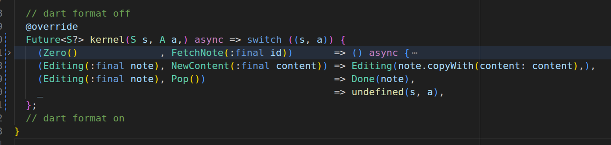
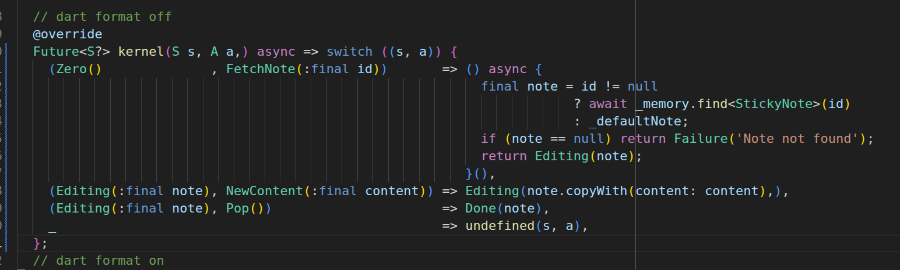

# cms

[English](README.md) | [中文](README_zh.md)

个人在学习`bloc`的时候，觉得和控制方程非常像，认为其是教导我用数学去思考。于是进步将其封装，使其接近数学形式。

从动力学的角度观看一个对象（例如app，菜单）如下：

```math
\begin{cases}
\dot s = f(s) \\
y = A \cdot s
\end{cases}
```

`bloc`即是 f，$`y = A \cdot s`$是观测方程，一般是UI，对应`BlocBuilder`等。不过这样里更关注状态方程。

进一步观察状态方程，变形为离散的形式：

```math
\begin{aligned}
&            & \dot s       &= f(s) \\
&\Rightarrow & \Delta s     &= s' - s \\
&\Rightarrow & s + \Delta s &= s' 
\end{aligned}
```

其中 s 是当前状态， $`\Delta s`$是状态的变化量，一般被人观察到而被称为动作或者事件。s' 是下一个状态。因而保持这样的形式写代码：

```math
(s, a) \to s'
```

远距离观看代码，满足这样的形式：



如果需要仔细检查内部细节，可以展开来看：




为什么不定义函数呢，而是用匿名函数呢？因为 S + A 就是注解，再去取一个名字比较费力。

## example

以 bloc 中的 [flutter-timer](https://bloclibrary.dev/tutorials/flutter-timer/) 为例：

用数学建模的思维去思考，首先是状态

```haskell
data S = Zero Int
       | Paused Int
       | Running Int
       | Completed Int
```

然后是用户能触发的动作

```haskell
data A = Start
       | Pause
       | Resume
       | Reset
```

> Tick 是后续进一步思考得到的内部事件，不一定要一次性建模完整，可以迭代。

翻译成 Dart 代码：


```dart

@freezed
sealed class S with _$S {
  const factory S.zero(int duration) = Zero;
  const factory S.paused(int duration, StreamSubscription<int> subscription) =
      Paused;
  const factory S.running(int duration, StreamSubscription<int> subscription) =
      Running;
  const factory S.completed(int duration) = Completed;
}

@freezed
sealed class A with _$A {
  const factory A.start() = Start;
  const factory A.pause() = Pause;
  const factory A.resume() = Resume;
  const factory A.reset() = Reset;
  const factory A.tick(int duration) = Tick;
}


class M extends Cms<S, A> {
  final Ticker _ticker;
  M(this._ticker) : super(const Zero(_duration));

  // dart format off
  @override
  S? kernel(S s, A a) => switch ((s, a)) {
    (Zero(:final duration)                        , Start())               => () {
                                                                                final subscription = _ticker
                                                                                    .tick(ticks: _duration)
                                                                                    .listen((duration) => add(Tick(duration)));
                                                                                return Running(duration, subscription);
                                                                              }(),
    (Running(:final duration, :final subscription), Pause())               => () {
                                                                                subscription.pause();
                                                                                return Paused(duration, subscription);
                                                                              }(),
    (Paused(:final duration, :final subscription) , Resume())              => () {
                                                                                subscription.resume();
                                                                                return Running(duration, subscription);
                                                                              }(),
    (Paused(:final subscription) 
    || Running(:final subscription)               , Reset())               => () {
                                                                              subscription.cancel();
                                                                                return const Zero(_duration);
                                                                              }(),
    (Completed()                                  , Reset())               => const Zero(_duration),
    (Running(:final subscription)                 , Tick(:final duration)) => () {
                                                                                if (duration > 0) {
                                                                                  return Running(duration, subscription);
                                                                                } else {
                                                                                  subscription.cancel();
                                                                                  return const Completed(0);
                                                                                }
                                                                              }(),
    _                                                                      => throw StateError('algebric error: $s -- $a -->'),
  };
  // dart format on
}
```

## 函数化

bloc 是支持一个事件产生多个状态的，cms 故意强约束为一个事件只能产生一个状态，并且用?表示无状态变化。如果有多个状态变化，则分解为多个事件依次触发，并用 add 来连接先后顺序。

比如，对于 fetch，它的变化是 loading -> loaded，可以拆解为如下

```dart
sealed class A with _$A {
  const factory A.fetch()           = _Fetch;   // -> loading
  const factory A._fetch$(int page) = _Fetch$;  // -> loaded
}
```

`.fetch()` 是用户看到的，而 `._fetch$()` 是内部事件，用户不可见。

```dart
switch ((s, a)) {
  Fetch   a =>  () {
                  add(_Fetch$(a.url));  // 后续执行
                  return s.copyWith(loading: true); // -> loading
                }(),
  _Fetch$ a =>  () async {
                  final data = await fetchData(a.url);
                  return s.copyWith(loading: false, data: data); // -> loaded
                }(),
}
```

验证了两种写法是等价的：

```dart
add(_Fetch$(a.url));  
return s.copyWith(loading: true);
// equals
emit(s.copyWith(loading: true));
add(_Fetch$(a.url));
```

## 转发

有的情景下需要监视外部对象的某个时间流，完全依赖外部，此时可以转发，将这个外部的事件转发为内部事件来处理。

```dart
class M extends Cms<S, A> {
  final ObjectBoxMemory _boxMemory;

  M(this._boxMemory) : super(const Zero());

  @override
  Future<S?> kernel(S s, A a) async => switch ((s, a)) {
    (Zero(:final notes) || Loaded(:final notes), WatchChanges()) => forward(
                                                                    _boxMemory
                                                                        .whereType<StickyNote>()
                                                                        .order(ObxStickyNote_.createdAt, OrderFlag.descending)
                                                                        .take(notes.length)
                                                                        .watch(),
                                                                    (notes) => UpdateNotes(notes),
                                                                    ).then((_) => null),
    _                                                            => undefined(s, a),
  };
}
```

## 响应速率

动作或者说事件是时变的，需要从时间的角度去看，即是一个流。某些场景下，用户可能会频繁触发某个事件，例如滚动加载更多数据时，用户可能会快速滑动列表触发多次加载事件。为了防止这种情况导致应用性能问题，可以使用响应速率控制（throttling）来限制事件的处理频率。

```dart
class M extends Cms<S, A> {
  M() : super(const Zero()) {
    pace<Fetch>(throttleDroppable(const Duration(milliseconds: 500)));
  }
}
```


## 辅助工具

- vscode extension: [cms](https://marketplace.visualstudio.com/items?itemName=dzylikecode.cms-generator)